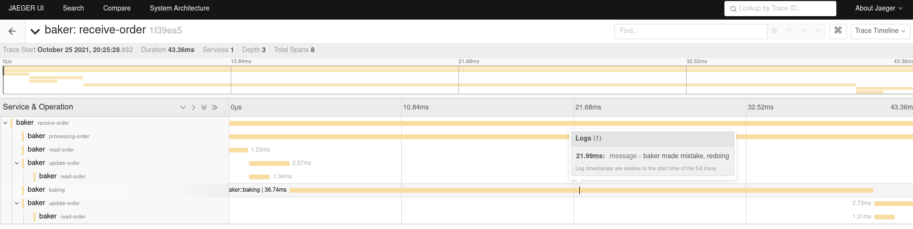

# Bakery


_Bakery_ is a very simple distributed service I used to learn how to use [Tilt](https://tilt.dev/) and the [OpenTelemetry](https://opentelemetry.io/) Go API.  It consists of 5 parts:  
* 'Reception' - a HTTP server that publishes to a queue  
* 'Baker' - a queue consumer  
* A [RabbitMQ](https://rabbitmq.com/) queue broker  
* A [Redis](https://redis.io/) database used to persist data between the publisher and consumer  
* An [OpenTelemetry collector](https://opentelemetry.io/docs/collector/) which is functioning as both an [agent](https://opentelemetry.io/docs/collector/getting-started/#agent) and [gateway](https://opentelemetry.io/docs/collector/getting-started/#gateway)


Additionally, when run with Tilt, two additional tools are made available:  
* a [Jaeger](https://www.jaegertracing.io/) service is started that the OpenTelemetry collector will export metrics to  
* a [k6](https://k6.io/) job that can be manually triggered to run a loadtest

## Running  

The following tools and versions were used for developing and testing _Bakery_:

| Tool | Version |
|------|---------|
| Go | v.1.14.2 |
| Tilt | v0.20.7 |  
| Minikube | v1.21.0 |
| Kubernetes | v.1.20.7 |

I recommend using a version manager like [asdf](https://github.com/asdf-vm/asdf) or [goenv](https://github.com/syndbg/goenv) to manage tool versions. The [Tilt documentation](https://docs.tilt.dev/choosing_clusters.html) lists options for local Kubernetes clusters.

Once the required tools are installed, start the service using Tilt:  

```
$ tilt up
Tilt started on http://localhost:10350/
v0.20.7, built 2021-06-10

(space) to open the browser
(s) to stream logs (--stream=true)
(t) to open legacy terminal mode (--legacy=true)
(ctrl-c) to exit
```

Opening the browser should show all the services being started and eventually available:  


You can confirm the `reception` service has started by sending a request to the exposed endpoint:

```
$ curl -s http://localhost:8000/ | jq
{
  "message": "reception is attended"
}
```

## Basic Use

Create a new order by sending a `POST` request to the `orders` endpoint:

```
$ curl -s -X POST \
  -d '{"customer": "homer", "pastry": "la bombe"}' \
  http://localhost:8000/orders | jq
{
  "orderKey": "1d5fba984abea5a7de4e2de5d1462bd3"
}
```

Check the status of the order by using the provided order key:

```
$ curl -s http://localhost:8000/orders/1d5fba984abea5a7de4e2de5d1462bd3 | jq
{
  "pastry": "la bombe",
  "customer": "homer",
  "orderTime": "2021-06-19T11:21:24Z",
  "status": "finished"
}
```

Examine traces in Jaeger by browing the exposed endpoint (http://localhost:16686):




## Generating lots of data

A k6 loadtest is provided to help generate enough data to meaningful interrogate the backend. Trigger the `k6` job from the UI and it will run a 15m loadtest. If you're using a service with ingest limits or that you pay for ingestion, be aware that this loadtest produces about 190k events. For the purpose of searching for traces, the `bakery.pastry` tag/attribute could have the following values:  

* "croissant"  
* "kouign-amann"  
* "la bombe"  
* "escargot"  
* "almond croissant"  
* "profiterole"  
* "caramel tart"  

## Adding different trace destinations

The OpenTelemetry collector is configured by the `otel-collector-config` ConfigMap in `tilt/tracing.yaml`. For example, if you want to add Honeycomb, modify the data as following:

```yaml
---
apiVersion: v1
kind: ConfigMap
metadata:
  name: otel-collector-config
data:
  otel-collector-config: |
    receivers:
      otlp:
        protocols:
          grpc:
          http:
    exporters:
      otlp:
        endpoint: "jaeger:55680"
        insecure: true
      otlp/2:
        endpoint: "api.honeycomb.io:443"
        headers:
          "x-honeycomb-team": YOUR_API_KEY
          "x-honeycomb-dataset": YOUR_DATASET_NAME
    processors:
      batch:
      memory_limiter:
        ballast_size_mib: 165
        limit_mib: 400
        spike_limit_mib: 100
        check_interval: 5s
    extensions:
      zpages: {}
    service:
      extensions:
        - zpages
      pipelines:
        traces:
          receivers:
            - otlp
          processors:
            - memory_limiter
            - batch
          exporters:
            - otlp
            - otlp/2
```

## Clean up

Use tilt to stop the services and delete them from your cluster:  

```
$ tilt down
Beginning Tiltfile execution
Successfully loaded Tiltfile (19.0233ms)
Deleting kubernetes objects:
→ Deployment/baker
→ Deployment/redis
→ Deployment/rabbitmq
→ Deployment/jaeger
→ Deployment/reception
→ Service/jaeger
→ Service/redis
→ Service/rabbitmq
→ ConfigMap/connection-details
```